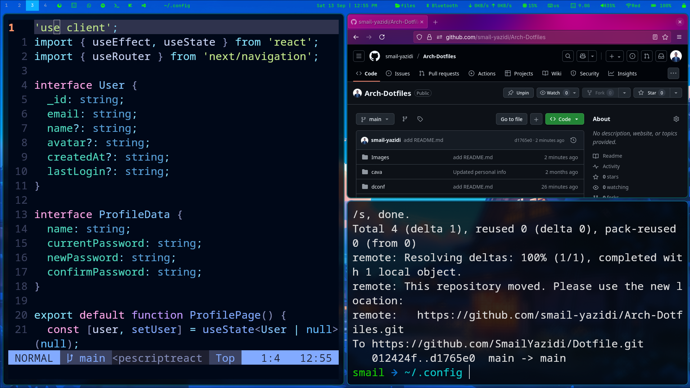
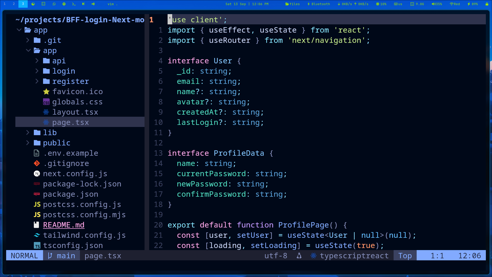

# 🚀 Arch Linux Dotfiles - Hyprland Rice




> A modern, minimal, and aesthetic Arch Linux configuration featuring Hyprland compositor with custom Waybar, Neovim setup, and development tools.

## ✨ Features

- **🪟 Window Manager**: Hyprland (Wayland compositor)
- **🎨 Status Bar**: Waybar with custom modules and icons
- **📝 Editor**: Neovim with LSP, Treesitter, and modern plugins
- **🚀 Terminal**: Kitty with custom theming
- **🔍 Launcher**: Rofi for application launching
- **🌈 Theme**: Tokyo Night with custom dark background
- **📁 File Manager**: Thunar with custom integration
- **🖼️ Wallpaper**: SWWW for dynamic wallpaper management
- **🔊 Audio**: PulseAudio/PipeWire with Waybar integration
- **📋 Clipboard**: Cliphist for clipboard history
- **🔒 Screen Lock**: Hyprlock integration

## 🖥️ Screenshots

*Your beautiful Hyprland setup with Waybar, terminal, and development environment*

## 📋 System Information

- **OS**: Arch Linux
- **WM**: Hyprland
- **Bar**: Waybar
- **Terminal**: Kitty
- **Editor**: Neovim
- **Browser**: Firefox
- **File Manager**: Thunar
- **Launcher**: Rofi

## 🛠️ Installation

### Prerequisites

Make sure you have the following packages installed:

```bash
# Essential packages
sudo pacman -S hyprland waybar kitty neovim firefox thunar rofi
sudo pacman -S swww wl-clipboard cliphist brightnessctl pamixer
sudo pacman -S playerctl grim slurp ttf-firacode-nerd

# Development tools
sudo pacman -S nodejs npm python python-pip jdk-openjdk
```

### Quick Setup

1. **Clone the repository**:
```bash
git clone https://github.com/smail-yazidi/Arch-Dotfiles.git
cd Arch-Dotfiles
```

2. **Backup existing configs** (optional but recommended):
```bash
cp -r ~/.config ~/.config.backup
```

3. **Copy configuration files**:
```bash
# Copy Hyprland config
cp -r .config/hypr ~/.config/

# Copy Waybar config
cp -r .config/waybar ~/.config/

# Copy Neovim config
cp -r .config/nvim ~/.config/

# Copy other configs as needed
```

4. **Set executable permissions for scripts**:
```bash
chmod +x ~/.config/hypr/scripts/*.sh
```

## ⌨️ Key Bindings

### Window Management
| Binding | Action |
|---------|---------|
| `Super + Return` | Open terminal (Kitty) |
| `Super + D` | Application launcher (Rofi) |
| `Super + N` | Firefox browser |
| `Super + M` | File manager (Thunar) |
| `Super + Q` | Close active window |
| `Super + F` | Toggle fullscreen |
| `Super + Shift + Space` | Toggle floating |
| `Super + H/J/K/L` | Focus window (Vim-style) |
| `Super + Shift + H/J/K/L` | Move window |

### Workspaces
| Binding | Action |
|---------|---------|
| `Super + 1-9` | Switch to workspace 1-9 |
| `Super + 0` | Switch to workspace 10 |
| `Super + Shift + 1-9` | Move to workspace 1-9 |
| `Super + Shift + 0` | Move to workspace 10 |
| `Super + -` | Toggle scratchpad |
| `Super + Shift + -` | Move to scratchpad |

### System Controls
| Binding | Action |
|---------|---------|
| `Super + C` | Copy selection |
| `Super + V` | Paste from clipboard history |
| `Super + W` | Kill Waybar |
| `Super + R` | Restart Waybar |
| `Super + Shift + E` | Exit Hyprland |
| `Super + Shift + Print` | Screenshot selection |

### Media Controls
| Binding | Action |
|---------|---------|
| `XF86AudioPlay/Pause` | Play/Pause media |
| `XF86AudioNext/Prev` | Next/Previous track |
| `XF86AudioRaiseVolume` | Volume up |
| `XF86AudioLowerVolume` | Volume down |
| `XF86AudioMute` | Toggle mute |
| `XF86MonBrightnessUp/Down` | Brightness control |

## 🔧 Configuration

### Hyprland
The main configuration is in `~/.config/hypr/hyprland.conf`:
- Custom keybindings with Arabic keyboard layout support
- Dual monitor setup with mirroring capability
- Window rules and appearance settings
- Startup applications and daemons

### Waybar
Located in `~/.config/waybar/`:
- **Left modules**: Workspaces, application shortcuts, window title
- **Center**: Clock with date/time
- **Right modules**: System resources, network, audio, battery
- Custom app launchers with tooltip descriptions
- Network speed monitoring and Bluetooth integration

### Neovim
Modern development setup in `~/.config/nvim/init.lua`:
- **LSP**: TypeScript, Python, Java support
- **Plugins**: Telescope, NvimTree, Lualine, TreeSitter
- **Theme**: Tokyo Night with custom background
- **Features**: Autocompletion, syntax highlighting, file explorer
- **Keybindings**: Space as leader key, intuitive shortcuts

## 🎨 Customization

### Changing Wallpaper
```bash
# Place your wallpaper in the hypr config directory
cp your-wallpaper.jpg ~/.config/hypr/
# Edit hyprland.conf
exec-once = swww img ~/.config/hypr/your-wallpaper.jpg
```

### Waybar Styling
Edit `~/.config/waybar/style-hyprland.css` to customize:
- Colors and transparency
- Module spacing and appearance
- Custom CSS animations

### Neovim Themes
The current setup uses Tokyo Night. To change themes, edit `~/.config/nvim/init.lua`:
```lua
-- Replace the colorscheme line
vim.cmd("colorscheme your-preferred-theme")
```

## 🌐 Development Environment

### Languages Supported
- **TypeScript/JavaScript**: ts_ls language server
- **Python**: Pyright language server  
- **Java**: JDTLS language server
- **Web**: HTML, CSS with Treesitter highlighting
- **Config**: Lua, JSON, YAML syntax support

### VS Code Integration
Launch VS Code from terminal or Waybar app launcher for seamless development workflow.

## 📁 Directory Structure

```
~/.config/
├── hypr/
│   ├── hyprland.conf          # Main Hyprland config
│   ├── hyprland.jpg           # Wallpaper
│   └── scripts/               # Custom scripts
│       ├── copy-selection.sh
│       ├── net_speed.sh
│       ├── wifi.sh
│       ├── bluetooth.sh
│       └── kb_layout.sh
├── waybar/
│   ├── config-hyprland        # Waybar modules config  
│   └── style-hyprland.css     # Waybar styling
├── nvim/
│   └── init.lua               # Complete Neovim setup
└── kitty/
    └── kitty.conf             # Terminal config
```

## 🔧 Troubleshooting

### Common Issues

**Waybar not starting:**
```bash
# Kill existing processes and restart
pkill waybar
waybar -c ~/.config/waybar/config-hyprland -s ~/.config/waybar/style-hyprland.css
```

**LSP not working in Neovim:**
```bash
# Install language servers
npm install -g typescript-language-server
pip install pyright
```

**Audio controls not working:**
```bash
# Install audio packages
sudo pacman -S pamixer playerctl pavucontrol
```

## 🤝 Contributing

Feel free to:
- Fork this repository
- Create feature branches
- Submit pull requests
- Report issues
- Suggest improvements

## 📝 License

This project is licensed under the MIT License. Feel free to use, modify, and distribute.

## 🙏 Acknowledgments

- [Hyprland](https://hyprland.org/) - Amazing Wayland compositor
- [Tokyo Night](https://github.com/folke/tokyonight.nvim) - Beautiful color scheme
- Arch Linux community for excellent documentation
- All the plugin developers and maintainers

## 📞 Contact

- GitHub: [@smail-yazidi](https://github.com/smail-yazidi)
- Repository: [Arch-Dotfiles](https://github.com/smail-yazidi/Arch-Dotfiles)

---

**⭐ If you find this configuration helpful, please give it a star!**